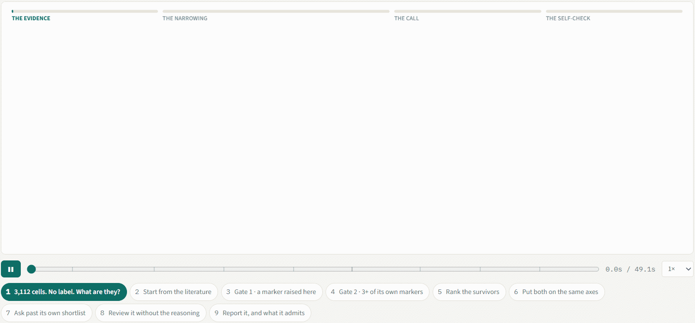

<h1 align="center">scMarkerAgent</h1>

<p align="center">
  <b>Evidence-grounded cell-type annotation for single-cell RNA-seq.</b><br>
  Every label comes with the markers that carry it, the sentences that assert them, and the publications they came from.
</p>

<p align="center">
  <a href="https://markeragent.net"></a>
  <a href="https://doi.org/10.5281/zenodo.22333283"></a>
  
  <a href="https://haoran-code.r-universe.dev/scmarkeragent"></a>
  <a href="LICENSE"></a>
</p>

<h3 align="center">How an annotation is made</h3>

<p align="center">Every call the annotation tool makes starts from the curated database and narrows it with the data you uploaded. This is one real run &mdash; a human prostate dataset, one cluster &mdash; replayed from the record it wrote. Every count on screen is that record's.</p>

<p align="center">
  
</p>
<p align="center"><sub>Replay it interactively, step by step, at <a href="https://markeragent.net">markeragent.net</a>.</sub></p>

scMarkerAgent annotates the clusters of a single-cell dataset without a reference atlas.
It retrieves candidate identities from a curated, literature-derived marker resource,
measures each candidate's whole marker panel in your data, and lets an agent decide which
identity the measurements support. Every label is delivered with its markers, their
detection fractions, the verbatim sentences and PMCIDs behind them, the competing
candidates and the quality-control verdict.

The same pipeline is implemented twice so that neither format has to be converted:

| Your data | Install | Reader |
| --- | --- | --- |
| `.h5ad` (AnnData / scanpy) | the Python arm, [`python/`](python/) | native AnnData |
| `.rds` (Seurat) | the R arm, [`R/`](R/) | native Seurat |

Both arms share one configuration, one prompt set, one marker resource and one output
schema. An arm refuses the other's format rather than converting it.

## Get started

Six steps. Steps 1, 3 and 4 are the same for both arms; step 2 depends on your data format.

### 1. Get the code

```bash
git clone https://github.com/HaoRan-Code/scMarkerAgent.git
cd scMarkerAgent
```

(To contribute, fork on GitHub first and clone your fork instead. Just to use the tool, a
plain clone is all you need.)

### 2. Install one arm

**Python arm, for `.h5ad`** (Python 3.12 exactly; every dependency is pinned):

```bash
conda create -n scmarkeragent python=3.12 -y && conda activate scmarkeragent   # any 3.12 environment works
pip install ./python
scmarkeragent --help
```

**R arm, for Seurat `.rds`** (R 4.2 or later). The package is served from its own
CRAN-like repository on R-universe, so one `install.packages()` brings in Seurat, `presto`
(the differential-expression engine, which is not on CRAN) and everything else, as
prebuilt binaries on Windows and macOS. No clone is needed for this step:

```r
options(repos = c(scmarkeragent = "https://haoran-code.r-universe.dev",
                  CRAN = "https://cloud.r-project.org"))
install.packages("scmarkeragent")
library(scmarkeragent)
```

Put the `options()` line in your `~/.Rprofile` to make it permanent. To install from a
clone instead (for example after editing the code), set the same `options()` and run
`remotes::install_local("R", dependencies = TRUE)` from the repository root; `presto` is
then resolved from the same repository.

Nothing here touches the GitHub API, whose anonymous quota (60 calls per hour per IP
address) is what makes `remotes::install_github()` fail with `HTTP error 403` behind
shared addresses. If R-universe itself is unreachable, `presto` can be cloned over the git
protocol at the commit the release was validated with:
`remotes::install_git("https://github.com/immunogenomics/presto.git", ref = "a24772a135c7895a8183b007376050556c60a05b")`.
If a CRAN package fails to compile from source, the cause is almost always a missing
system library; the message names it (`libxml2`, `libcurl`, `libpng`, ...). Install it with
your system's package manager and rerun.

<details>
<summary>Python arm without cloning</summary>

```bash
pip install "git+https://github.com/HaoRan-Code/scMarkerAgent.git#subdirectory=python"
```

</details>

### 3. Download the marker resource (once, about 760 MiB)

The curated resource is what every annotation is measured against. It is too large for
git, so either arm fetches it from Zenodo and checks every file against a shipped SHA-256
index; a truncated download fails instead of annotating against half a database.

```bash
scmarkeragent download-resources --dest ~/scmarkeragent-resources
```

```r
scmarkeragent::download_resources("~/scmarkeragent-resources")
```

Offline machine: download `scmarkeragent-curated.tar.gz` from
[doi:10.5281/zenodo.22333283](https://doi.org/10.5281/zenodo.22333283), unpack it anywhere,
and use that directory in step 5.

### 4. Set a language-model credential

The annotating agent and its judges call an OpenAI-compatible endpoint.

```bash
export OPENAI_API_KEY="sk-..."
export OPENAI_BASE_URL="https://..."   # only for a compatible provider; omit for OpenAI
```

```r
Sys.setenv(OPENAI_API_KEY = "sk-...")
Sys.setenv(OPENAI_BASE_URL = "https://...")   # only for a compatible provider
```

Every call is cached by prompt hash, so rerunning the same data costs nothing, and every
cold call is written to an audit log. `SCMA_LLM_MODEL` overrides the default model.

### 5. Run

Three things about your data are required and never guessed: the species, the tissue, and
**where the raw counts are** (`--counts-source` / `counts_source`). Annotating a normalized
matrix as if it were counts is the one failure that produces plausible output from wrong
input, so the pipeline refuses to guess.

```bash
scmarkeragent annotate \
  --input pbmc.h5ad --tag pbmc \
  --species Human --tissue blood \
  --counts-source X \
  --resource-dir ~/scmarkeragent-resources
```

```r
scmarkeragent::annotate(
  input = "pbmc.rds", tag = "pbmc",
  species = "Human", tissue = "blood",
  counts_source = "RNA/counts",
  resource_dir = "~/scmarkeragent-resources"
)
```

| | |
| --- | --- |
| `--species` / `species` | `Human`, `Mouse` or `Rat` |
| `--tissue` / `tissue` | free text, resolved against UBERON (`blood`, `liver`, `prostate gland`, ...) |
| `--counts-source` | Python: `X`, `raw.X` or `layers/<name>`. R: `<assay>/<layer>`, for example `RNA/counts` |
| `--disease` / `disease` | default `Normal` |
| `--clustering-resolution` | Leiden resolution, default 0.5; clustering is always recomputed from the counts |
| `--work-dir` / `work_dir` | where cache and results go; default `./.scmarkeragent` |
| `--offline` / `offline = TRUE` | run the deterministic stages only, never contact a model |

### 6. Read the results

Everything lands in `.scmarkeragent/results/<tag>/`. Open `viewer/index.html` for the
interactive report, or read the tables:

| File | What it holds |
| --- | --- |
| `cluster_summary.csv` | one row per cluster: the label, its parent and subtype, `resolution_status` (`resolved`, `mixed`, `unresolved`), confidence, rationale, QC verdict, key markers with detection fractions, PMCIDs |
| `marker_evidence.csv` | every measured marker of every claimed identity, with detection in and out of the cluster, fold change, publication support, PMCID and the source sentence |
| `cluster_evidence.jsonl` | the audit trail: every retrieved candidate with its scores and full panel, every agent turn and tool call, every judge verdict |
| `figures/`, `figure_data/` | figures and the numbers behind each one |
| `run_manifest.json` | run status and the path of every delivered file |

A cluster carrying two populations is reported as `mixed` with both identities and their
evidence; insufficient evidence is reported as `Unknown`, never forced into a label.
`annotation_confidence` is an evidence score, not a probability. One label is broadcast to
every cell in a cluster, so raise `--clustering-resolution` if a minority population
inside a cluster matters for your question.

<details>
<summary>Smoke test: check the installation in one minute, without a model or your own data</summary>

`python/examples/` holds an 80-cell synthetic dataset in both formats. It exercises the
whole pipeline and says nothing about annotation quality (250 genes, no real biology). The
raised resolution is needed because at the default 0.5 these 80 cells form a single
cluster, which the pipeline refuses: one-vs-rest differential expression is undefined then.

```bash
scmarkeragent annotate --input python/examples/synthetic_input.h5ad --tag smoke \
  --species Human --tissue blood --counts-source X --clustering-resolution 1.0 \
  --resource-dir ~/scmarkeragent-resources --offline
```

```r
scmarkeragent::annotate(
  input = "python/examples/synthetic_input.rds", tag = "smoke",
  species = "Human", tissue = "blood", counts_source = "RNA/counts",
  clustering_resolution = 1.0, resource_dir = "~/scmarkeragent-resources", offline = TRUE
)
```

Success looks like `"status": "completed"` in the printed manifest and a
`.scmarkeragent/results/smoke/` directory with the files listed above.

</details>

## Repository layout

```
python/          Python package (.h5ad arm); also carries the shared pipeline sources and the smoke-test data
R/               R package (.rds arm)
required_files/  the resource download contract and checksum index (the data itself is on Zenodo)
docs/            the walkthrough recording shown above
```

Per-arm details (every option, environment variables, tests): [`python/README.md`](python/README.md)
and [`R/README.md`](R/README.md).

## Citing

Please cite the archived code and resource: [doi:10.5281/zenodo.22333283](https://doi.org/10.5281/zenodo.22333283).

## Licence

Noncommercial use only. Code: PolyForm Noncommercial 1.0.0 ([`LICENSE`](LICENSE)). Marker
resource: CC BY-NC 4.0; its source sentences are quoted from PubMed Central open-access
articles and every row carries its PMCID/PMID. The third-party ontology and ortholog files
keep their own terms, recorded per file in the resource's `resource_manifest.json`.
